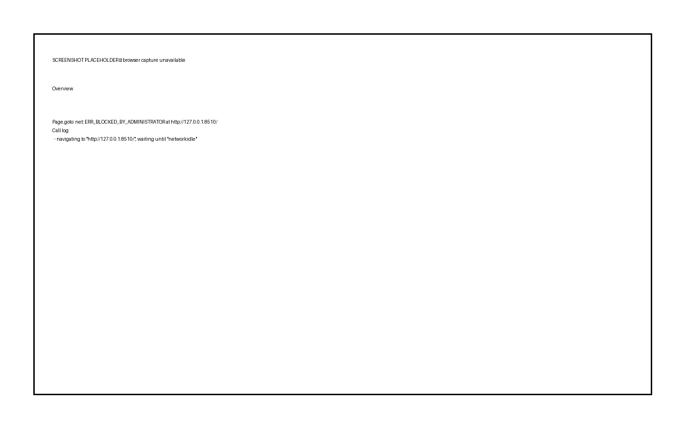
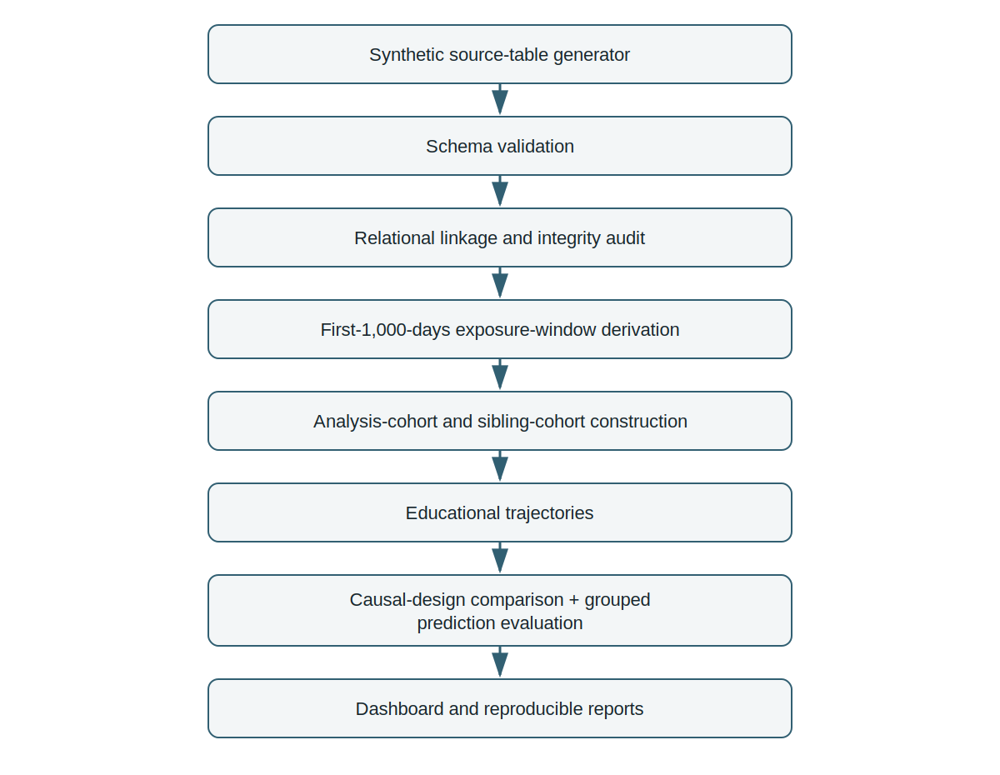

# first1000days-linked-cohort-lab

**A fully synthetic laboratory for constructing and auditing an intergenerational linked cohort, defining first-1,000-days parental exposure windows, comparing conventional and sibling designs, and evaluating aggregate early-life educational-risk models.**

> **Research and methods demonstration only. Every person, family, event, date and outcome in this repository is entirely synthetic and computer-generated. The repository contains no patient, family, education, hospital, suicide, NAPLAN, Curtin, Australian, United Kingdom or linked administrative data. It is not a clinical, educational or public-sector decision-support system; it must not be used to assess, rank or intervene on any real person or family; and it does not demonstrate data access, clinical validity, causal identification, regulatory compliance or real-world feasibility.**



## Quick start

```bash
python -m venv .venv
# activate the environment using the platform-appropriate command
python -m pip install --upgrade pip
pip install -r requirements.txt
python scripts/generate_demo_data.py --force
python scripts/build_analysis_cohort.py
python scripts/run_linkage_audit.py
python scripts/run_causal_demo.py
python scripts/run_prediction_demo.py
streamlit run app.py
```

A fresh clone may also start directly with `streamlit run app.py`; the application bootstraps missing synthetic files deterministically without paid services, external APIs, credentials, or real datasets.

## Three-minute demo workflow

1. Open **Overview** and state the synthetic-data boundary.
2. Compare clean and corrupted datasets in **Linkage Audit**.
3. Inspect inclusive preconception, pregnancy, and postnatal exposure windows.
4. Review synthetic educational trajectories and missingness.
5. Compare naive, adjusted, and sibling fixed-effects estimates against simulation truth.
6. Review family-grouped discrimination, calibration, subgroup auditing, and permutation importance.
7. Close with reproducibility metadata and prohibited interpretations.

See [`docs/DEMO_SCRIPT.md`](docs/DEMO_SCRIPT.md) for a timed spoken script.

## Project context

This portfolio MVP supports an application related to the Curtin University PhD project **“Intergenerational Transmission of Mental Health During the First 1,000 Days of Life: Educational Trajectories, Suicidal Behaviour, and Precision Risk”**, proposed supervisor **Dr Getinet Yaya**. It demonstrates methodological readiness without claiming access to restricted data, institutional endorsement, completion of the advertised research, or real-world validity.

## Architecture



The implementation separates source generation, schema validation, linkage audit, exposure derivation, cohort construction, causal-design comparison, predictive evaluation, reporting, and the dashboard. Latent simulation variables are stored only under `data/synthetic/ground_truth/` and never enter normal analyses or prediction features.

## Source-table design

The generator creates independent tables for families, parents, children and births, parental mental-health-related events, repeated educational assessments, and offspring outcome events. Identifiers are deterministic synthetic keys such as `FAM-000001`, `M-000001`, `P-000001`, and `CH-000001`.

The clean data normally contain about 3,000–3,500 children. Corrupted copies include at least 45 deterministic issues across at least 12 rule types, accompanied by `corruption_manifest.csv`.

## Exposure-window definitions

All boundaries are inclusive and windows are mutually exclusive for each child-parent relation:

- **Preconception:** conception date minus 365 days through conception date minus one day.
- **Pregnancy:** conception date through birth date.
- **Postnatal 0–2 years:** birth date plus one day through birth date plus 730 days.

Maternal and paternal event counts, first dates, binary flags, and any-parent flags are derived from event-level source records rather than generated directly in the final cohort.

## Linkage audit

The rule engine reports one row per issue with stable rule IDs, severity, affected record and field, rationale, remediation, and whether the issue blocks analysis. It checks keys, parent-child links, family structure, chronology, repeated educational records, outcomes, and exposure rows. It never silently repairs source data.

## Causal-design demonstration

The primary synthetic outcome is `age12_literacy_standardised_score_demo`; the primary exposure is `maternal_pregnancy_exposure_demo`. The repository compares:

1. an unadjusted cohort model;
2. an observed-confounder-adjusted cohort model with family-clustered uncertainty;
3. a within-family demeaned sibling fixed-effects model restricted to eligible exposure-discordant sibling sets.

The simulation includes unobserved shared family liability and a known maternal-pregnancy effect near −0.20 standard deviations. The comparison is explicitly labelled **“Simulation comparison — not an empirical causal result.”** Sibling analysis is not described as causal proof.

## Prediction evaluation

> **Synthetic aggregate evaluation only — not an individual risk tool.**

The target is a synthetic adverse educational trajectory, not suicide or self-harm. Features are restricted to information conceptually available by age two. Families are separated using `GroupShuffleSplit`; grouped cross-validation is used in development. A regularised logistic model and `HistGradientBoostingClassifier` are evaluated on a final held-out family set using AUROC, average precision, Brier score, log loss, calibration intercept and slope, reliability bins, subgroup audits, and aggregate permutation importance.

No sortable risk table, “top-risk” view, intervention threshold, child-level explanation, or row-level prediction export is provided.

## Tests

```bash
pytest -q
pytest --cov=src/first1000days_lab --cov-report=term-missing
ruff check .
python scripts/privacy_scan.py
```

Tests cover deterministic generation, schemas, corruption detection, exposure boundaries, cohort construction, sibling eligibility, causal simulation behaviour, family leakage, forbidden feature leakage, calibration, subgroup suppression, reports, bootstrap behaviour, and privacy scanning.

## Reproducibility

The default seed is `20260715`, package version is `0.1.0`, and all key settings are stored in YAML. Generated files are deterministically sorted. Reports include configuration and file hashes, row and family counts, sibling-set counts, creation timestamps, rulebook version, and repository version.

## What this demonstrates

- reproducible multi-table cohort architecture;
- transparent relational linkage and integrity auditing;
- explicit first-1,000-days exposure-window construction;
- correct handling of families and sibling clusters;
- comparison of cohort and within-family analytical designs;
- strict separation of causal-estimation and predictive-evaluation tasks;
- family-grouped model validation;
- calibration and subgroup-performance reporting;
- tested and documented Python research software.

## What this does not demonstrate

- access to Curtin, Australian, UK, education, hospital, suicide, NAPLAN, cohort or linked administrative data;
- real probabilistic record linkage;
- the validity of any clinical diagnosis or educational measure;
- the causal effect of parental mental illness;
- real suicide or self-harm risk;
- a deployable precision-prevention model;
- transportability between jurisdictions;
- fairness or equity;
- clinical, educational, regulatory, privacy or cybersecurity compliance;
- real-world feasibility;
- endorsement by any institution;
- completion of the advertised PhD.

## Limitations

This is a deliberately compact simulation. Its associations are programmed, missingness is simplified, the linkage audit uses synthetic deterministic keys, the sibling estimator cannot solve non-shared confounding or carryover, model performance does not establish fairness or transportability, and no real governance environment is represented.

## Relation to the PhD application

The repository evidences preparation for linked longitudinal cohort architecture, first-1,000-days exposure specification, linkage-quality auditing, sibling-comparison programming, calibration-focused model evaluation, and professional research-software practice. It does not substitute for supervisor guidance, data custodianship, ethics approval, statistical analysis planning, stakeholder governance, or the substantive PhD.

## Citation

Use the metadata in [`CITATION.cff`](CITATION.cff). Suggested citation: Saleh Estaki Organi (2026), *first1000days-linked-cohort-lab*, version 0.1.0, synthetic methods demonstration.

## Licence

MIT. See [`LICENSE`](LICENSE).
